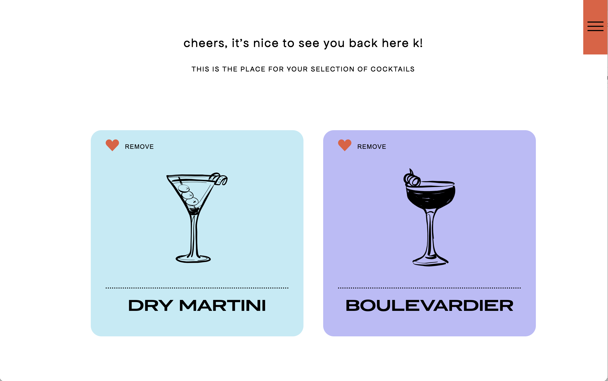
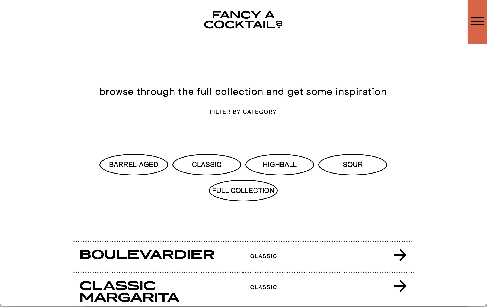

# Fancy a cocktail?

sure you do! and in order to help you find the right one, i created this web application!

you will certainly find inspiration browsing through the full collection, where you can also filter different categories and learn more about all of the cocktails.

on top of this, after user authorization you will be able to get a recommendation based on your personal taste, due to multiple matching algorithms. in addition, you can add your favourites to a selection in order to remember and go back to them.

deployed version on heroku: https://fancycocktail.herokuapp.com

have fun with it! cheers!

## Technologies used

**Client:** Next.js, React, TypeScript, Styled Components, Jest, Playwright

**Server:** Node.js, PostgreSQL

## Design

this application is **responsive** for all screen sizes.

the design, illustrations and css-styling were created and executed by myself.

## Planning

in case you are interested, view my **figma design board**: https://bit.ly/3ojmePc

and this is my **drawSQL database schema**: https://drawsql.app/lupsky/diagrams/cocktails

## Screenshots

### Landing page


### Recommendation


### Selection



### Collection



## Setup guide

To run this project locally, the following steps are needed:

1. Clone this repo on your local machine and connect to your GitHub account

2. Download and install PostgreSQL (if not installed yet).

- https://www.postgresql.org/download/

3. Create a User and a Database for the project.

4. Create a copy of the `.env.example` and name it `.env` on the root of the project and modify it with your PostgreSQL credentials. The file should include these four environment variables:

- PGHOST=localhost
- PGDATABASE=\<YOUR_POSTGRES_DATABASE>
- PGUSERNAME=\<YOUR_POSTGRES_USERNAME>
- PGPASSWORD=\<YOUR_POSTGRES_PASSWORD>

5. Create a Cloudinary account and use the credentials for Image Uploads.

6. Add the next environment variables to your .env file

- BASE_URL=\<YOUR_API_URL>
- CSRF_SECRET=\<CRSF_SALT_KEY>

7. Install the dependencies

```bash
$ yarn
```

8. Install dotenv-cli globally with:

```bash
$ yarn global add dotenv-cli
```

9. In a terminal window start PostgreSQL

```bash
$ postgres
```

10. Run the migrations for your local database with:

```bash
$ yarn migrate up
```

11. Start the application with:

```bash
$ yarn dev
```

## Deployment instructions

The following instructions can be used to deploy the application online using Heroku:

1. Create a repository with your version of the app.
2. Sign up on Heroku: https://signup.heroku.com/ and create an account
3. Create a new App with your preferred name
4. Choose a name and select your region
5. On "deploxment method", go to "Connect to GitHub" and select your repository
6. Click on the "Enable Automatic Deploys" button
7. Go back to the Overview tab and click on "Configure Add-On". Search for "Postgres" and select "Heroku Postgres" from the results
8. TODO: ENV variables
9. Trigger the deployment by pushing into your github repository
